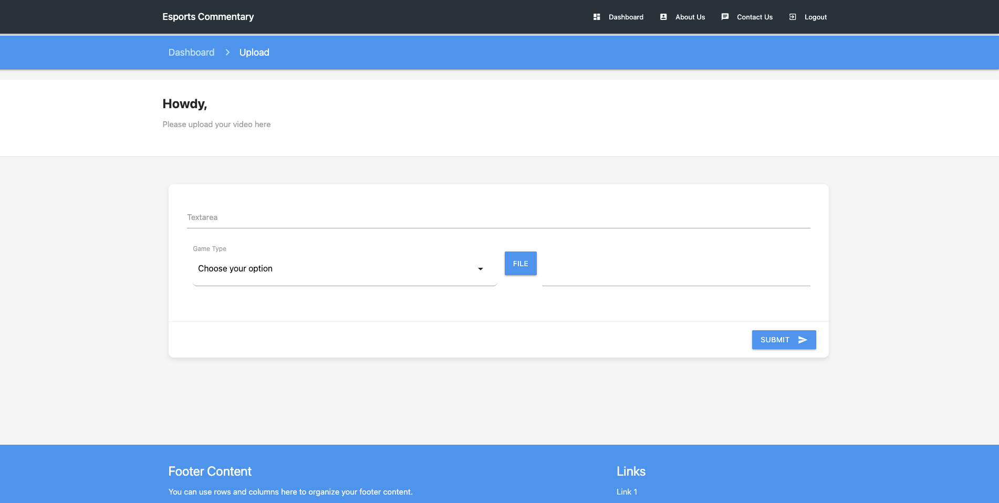

# Esports-Commentary
Esports commentary powered by machine learning (ML) refers to the automated or AI-assisted analysis and narration of competitive gaming events. Using real-time data from the game, machine learning models provide dynamic, insightful, and engaging commentary, often supplementing or replacing human commentators.




### 1. Create and Activate a Virtual Environment

```bash
pip install virtualenv
```

Now, create and activate the virtual environment:

```bash
virtualenv venv
source venv/bin/activate  # On Windows use `venv\Scripts\activate`
```

#### 2. Install Dependencies

Once the virtual environment is activated, install the project dependencies from the `requirements.txt` file:

```bash
pip install -r requirements.txt
```

## 3. Set Up Environment Variables

Create a `.env` file in the project root directory and add the required environment variables. For example:

```plaintext
DJANGO_SECRET_KEY=your-secret-key
DEBUG=True
ALLOWED_HOSTS=localhost,127.0.0.1
```

## 4. Apply Database Migrations

```bash
python manage.py makemigrations
python manage.py migrate
```

## 5. Run the Development Server

```bash
python manage.py runserver
```

## 6. Accessing the Application

```bash
http://127.0.0.1:8000/
```

